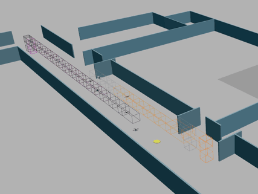

UTM Formalization, Prototype, Verification, and Performance Evaluation
======================================================================

This directory contains all scripts for our exploration of using existing formal verification and simulation tools to
verify and evaluate Unmanned Air-traffic Management (UTM) protocols.
A preprint version of our research paper is available on arXiv at https://arxiv.org/abs/2009.04655

The structure of this directory is as follows:

* **Safety Proof**:
  `ioa/` contains our UTM Airspace Manager protocol formally specified in 
  [Dione language for Input/Output automata](https://doi.org/10.1007/978-3-030-34968-4_13) and
  instructions to automatically prove the invariant. 

* **Reachability Analysis**:
   `../drvy_analysis/` contains scripts and instructions to generate simulation traces, compute reachtube
   using DryVR reachability analysis, and plot the reachtubes.

* **Performance Evaluation**:

  + `dist_mutex_contr/` contains the Python implementation of our UTM protocol for simulation with the CyPhyHouse Cymulator.  
  + `eceb_scenarios.py` defines waypoints each agent has to follow in different simulation scenarios.
  + `test_protocol.py` is the entry point to run the simulation with a selected scenario.
  + `results/` contains the experiment result collected for all scenarios discussed in our paper as well as
    the script to process the result and generate csv files for plotting using Latex.


Performance Evaluation with Gazebo Simulation
=============================================

Install Packages for simulation
-------------------------------

Please follow the steps in the parent directory to install the CyPhyHouse Cymulator.
Steps below are addition packages required for running UTM experiments with the CyPhyHouse Cymulator.

3. Clone and install Python library for processing reachtubes and Operation Volume Contracts.
   ```shell
   git clone https://gitlab.engr.illinois.edu/chsieh16/reachtube.git ReachtubeRepo
   pip3 install --user -e ReachtubeRepo/
   ```


Run experiment scripts
----------------------

The following steps are for a simulation in the default scenario where six drones pass through a corridor.

1. Set up the Gazebo simulation world with six drones at a corridor inside the ECE building.
   Note that you may have to adjust the view in Gazebo to see the drones around coordinate (-80, -65, 0).
   ```shell
   source catkin_ws/devel/setup.bash  # catkin_ws is your workspace for catkin
   rosrun cym_gazebo cymulate.py ../scenes/simple_corridor.yml
   ```

2. In another terminal, run the following script to start the simulation with the default scenario.
   ```shell
   source catkin_ws/devel/setup.bash  # catkin_ws is your workspace for catkin
   python3 test_protocol.py ../scenes/simple_corridor.yml
   ```

You should see a simulation similar to the following.



You can modify above steps and `test_protocol.py` to simulate with different scenes and agents.
